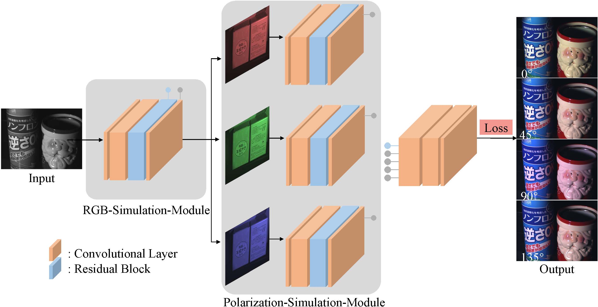

# Convolutional demosaicing network for joint chromatic and polarimetric imagery


 Our paper is accepted by **Optics Letters 2019**. 

<div align=center>   </div>

**Picture:**  *Architecture of the proposed CPDNet.*


<div align=center>   </div>

**Picture:**  *Visual results.*


This repository contains the official Tensorflow implementation of the following paper:

> **Convolutional Demosaicing Network for Joint Chromatic and Polarimetric Imagery**<br>
>  Sijia Wen, Yinqiang Zheng, Feng Lu, Qinping Zhao <br> https://www.osapublishing.org/ol/abstract.cfm?uri=ol-44-22-5646
> 
>**Abstract:**  Due to the latest progress in image sensor manufacturing technology, the emergence of a sensor equipped with an RGGB Bayer filter and a directional polarizing filter has brought significant advantages to computer vision tasks where RGB and polarization information is required. In this regard, joint chromatic and polarimetric image demosaicing is indispensable. However, as a new type of array pattern, there is no dedicated method for this challenging task. In this Letter, we collect, to the best of our knowledge, the first chromatic-polarization dataset and propose a chromatic-polarization demosaicing network (CPDNet) to address this joint chromatic and polarimetric image demosaicing issue. The proposed CPDNet is composed of the residual block and the multi-task structure with the costumed loss function. The experimental results show that our proposed methods are capable of faithfully recovering full 12-channel chromatic and polarimetric information for each pixel from a single mosaic image in terms of quantitative measures and visual quality. 

## Resources

Material related to our paper is available via the following links:

- Paper:   https://www.osapublishing.org/ol/abstract.cfm?uri=ol-44-22-5646
- Code: https://github.com/wsj890411/CPDNet

## System requirements

* 64-bit Python 3.5 installation. 
* TensowFlow 1.14.0 or newer with GPU support.
* One or more high-end NVIDIA GPUs with at least 8GB of DRAM.

## Playing with pre-trained networks and training

### Test

1. Download the pretrained model, and put them to the `pretrained_model` dir
2. Run the command below to decompose images into albedo and shading

```bash
python3 test.py -c configs/intrinsic_MPI.yaml -i /your/test/images/root/ -o ./results/ -p /pretrained_model/MPI.pt
```

Then then results will be generated in the `./results` dir.

### Train
1. Download the dataset to your `<your_dataset_root>`.
2. Midify the `data_root` to `<your_dataset_root>` in the `*.yaml` in the `./configs`.
3. Run the commands below to train the model.

```bash
python3 train.py -c configs/intrinsic_MPI.yaml -o ./checkpoints/ -g <your gpu id>
```

## Citation

If you find this work or code is helpful in your research, please cite:

```latex
@article{wen2019convolutional,
  title={Convolutional demosaicing network for joint chromatic and polarimetric imagery},
  author={Wen, Sijia and Zheng, Yinqiang and Lu, Feng and Zhao, Qinping},
  journal={Optics letters},
  volume={44},
  number={22},
  pages={5646--5649},
  year={2019},
  publisher={Optical Society of America}
}
```


